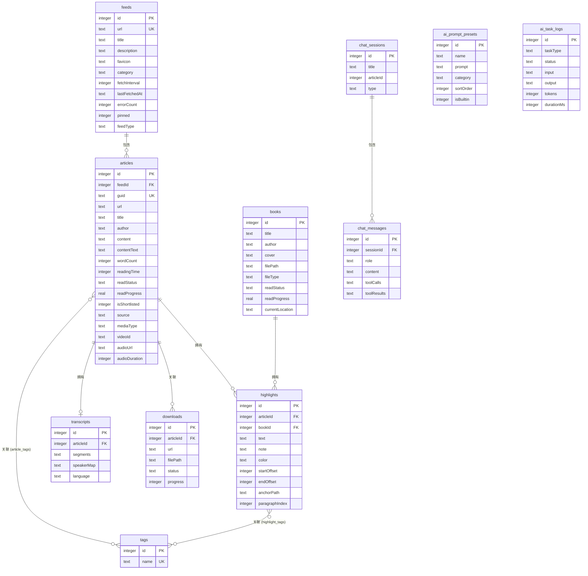

# Z-Reader 架构概述

## 系统上下文 (C4 Level 1)

Z-Reader 作为桌面应用运行在用户本地，与多个外部系统交互以获取和处理内容。


## 容器架构 (C4 Level 2)

Z-Reader 基于 Electron 的多进程架构，分为主进程、渲染进程和预加载桥接三大核心容器。


## 组件架构 (C4 Level 3)

### 主进程组件关系


### 渲染进程组件关系


## 架构模式

### 1. Electron 多进程架构

Z-Reader 严格遵循 Electron 的安全最佳实践：

- **主进程**：负责数据库操作、文件系统访问、网络请求、系统级功能
- **渲染进程**：纯 UI 渲染与交互，不直接访问 Node.js API
- **Preload 桥接**：通过 `contextBridge` 暴露安全的 `electronAPI` 接口
- **IPC 通信**：所有数据流通过 IPC 通道传递，确保进程隔离

### 2. 分层服务架构

```
┌─────────────────────────────┐
│  渲染进程 (React UI 层)       │
├─────────────────────────────┤
│  Preload 桥接层               │
├─────────────────────────────┤
│  IPC 处理器层 (路由分发)       │
├─────────────────────────────┤
│  业务服务层 (核心逻辑)         │
├─────────────────────────────┤
│  数据访问层 (Drizzle ORM)     │
├─────────────────────────────┤
│  SQLite 数据库                │
└─────────────────────────────┘
```

### 3. 本地优先 (Local-First) 架构

- 所有数据存储在本地 SQLite，即时生效
- 断网无损：全部功能离线可用
- 增量同步：通过 iCloud 文件系统实现设备间同步
- 冲突解决：基于时间戳的合并策略

### 4. 事件驱动的流式通信

对于 AI 聊天和 ASR 识别等需要流式输出的场景，采用事件驱动模式：
- 渲染进程通过 `send()` 发起请求
- 主进程通过事件发射器推送流式数据
- 渲染进程通过 `on()` 监听并实时渲染

## 数据库设计

### 实体关系图



### 核心表说明

| 表名 | 用途 | 记录数量级 |
|------|------|-----------|
| `feeds` | RSS/播客订阅源 | 百级 |
| `articles` | 文章/视频/播客条目 | 万级 |
| `highlights` | 高亮标注 | 千级 |
| `tags` | 标签 | 百级 |
| `article_tags` | 文章-标签关联 | 千级 |
| `highlight_tags` | 高亮-标签关联 | 千级 |
| `books` | 电子书 | 百级 |
| `transcripts` | 转录文本 | 百级 |
| `downloads` | 下载记录 | 百级 |
| `chat_sessions` | AI 聊天会话 | 百级 |
| `chat_messages` | AI 聊天消息 | 千级 |
| `ai_prompt_presets` | AI 预设模板 | 十级 |
| `ai_task_logs` | AI 任务日志 | 千级 |
| `views` | 自定义视图 | 十级 |

## IPC 通信架构

### 通道分类

Z-Reader 定义了 **60+ IPC 通道**，按功能域分组：


### 通信模式

| 模式 | 用途 | 方法 |
|------|------|------|
| **请求-响应** | 数据 CRUD | `invoke()` / `handle()` |
| **事件推送** | 流式输出 | `send()` / `on()` |
| **事件取消订阅** | 防止内存泄漏 | `on()` 返回 `unsubscribe` 函数 |

## 关键设计决策

### 1. SQLite + Drizzle ORM
- **决策**：使用 SQLite 作为唯一数据源，Drizzle ORM 提供类型安全
- **理由**：本地优先架构要求低延迟、离线可用；Drizzle 提供编译时类型检查
- **权衡**：牺牲了云端实时同步的便利性，换取完全的数据控制权和离线体验

### 2. IPC 通道化通信
- **决策**：每个功能域独立的 IPC 处理器模块
- **理由**：职责分离清晰，便于维护和测试
- **权衡**：处理器数量多（20+），需要严格的命名规范

### 3. 多阅读器实现
- **决策**：为 HTML/EPUB/PDF/视频/播客各自实现专用阅读器
- **理由**：每种格式的交互模式差异巨大，统一抽象成本过高
- **权衡**：代码量增大，但每个阅读器可以针对性优化

### 4. AI 工具调用模式
- **决策**：AI 通过工具定义与数据库交互
- **理由**：提供结构化的 AI 访问控制，防止意外数据修改
- **权衡**：工具注册和上下文维护增加了复杂度

### 5. 基于文件的 iCloud 同步
- **决策**：通过 iCloud Drive 文件系统进行增量同步
- **理由**：利用 Apple 已有的基础设施，无需自建同步服务器
- **权衡**：依赖 iCloud 生态，非 Apple 用户无法使用

## 模块概览

### 主进程模块

| 模块 | 核心职责 | 关键文件 |
|------|---------|---------|
| **数据库层** | Schema 定义、连接管理 | `schema.ts`, `index.ts` |
| **IPC 层** | 请求路由与处理 | 20+ handler 文件 |
| **RSS 服务** | 订阅抓取与解析 | `rss-service.ts` |
| **解析服务** | 正文提取与统计 | `parser-service.ts`, `text-stats.ts` |
| **YouTube 服务** | 视频流与字幕 | `youtube-service.ts` |
| **播客服务** | 播客搜索与解析 | `podcast-resolver.ts`, `podcast-directory-service.ts` |
| **同步引擎** | iCloud 多设备同步 | `sync/` 目录 8 个文件 |
| **ASR 服务** | 语音转文字 | `asr/` 目录 + `audio-pipeline.ts` |
| **AI 模块** | LLM 集成与工具 | `src/ai/` 14 个文件 |
| **API 服务器** | REST API 暴露 | `api-server.ts` |

### 渲染进程模块

| 模块 | 核心职责 | 关键组件 |
|------|---------|---------|
| **布局** | 三栏交互 | `Sidebar`, `ContentList`, `DetailPanel` |
| **阅读器** | 多格式阅读 | `ReaderView`, `EpubReader`, `PdfReader`, `VideoReaderView`, `PodcastReaderView` |
| **对话框** | 表单与设置 | `AddFeedDialog`, `PreferencesDialog` |
| **功能** | 搜索/AI/下载 | `CommandPalette`, `ChatPanel`, `SearchPanel` |
| **发现** | 内容源发现 | `DiscoverPage`, `FeedPreview` |
| **分享** | 卡片生成 | `ShareCardModal`, 5 种主题 |
| **通用** | 基础交互 | `ArticleCard`, `TagPicker`, `Toast` |
