# Z-Reader 工作流概述

## 核心工作流

### 1. RSS 订阅与内容抓取

用户添加 RSS 订阅后，系统自动定时抓取并解析文章内容。

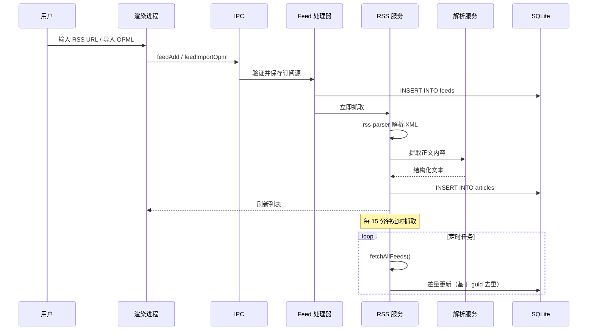

**关键细节：**
- 使用 `ETag` / `Last-Modified` 避免重复抓取
- 检测 Podcast 类型（`itunes:*` 命名空间），区分文章与播客
- 解析失败时降级为原始 HTML 模式
- 支持 `content:encoded`、`yt:videoId` 等自定义字段

### 2. 文章阅读与高亮标注

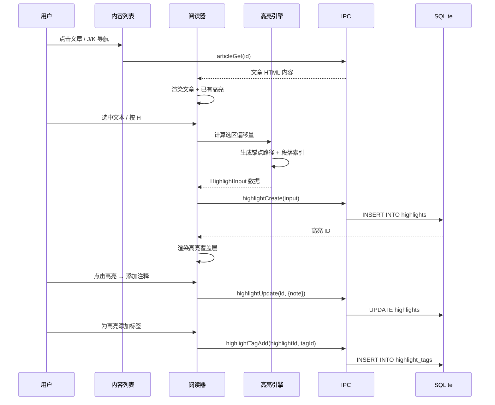

**高亮引擎工作原理 (`highlight-engine.ts`)：**
1. 捕获文本选区 (`Selection` API)
2. 计算 DOM 锚点路径和字符偏移量
3. 序列化为可持久化的位置信息
4. 还原时根据锚点路径定位 DOM 节点
5. 使用 `AnnotationLayer` 组件渲染半透明覆盖层

### 3. Feed-Library 内容分流

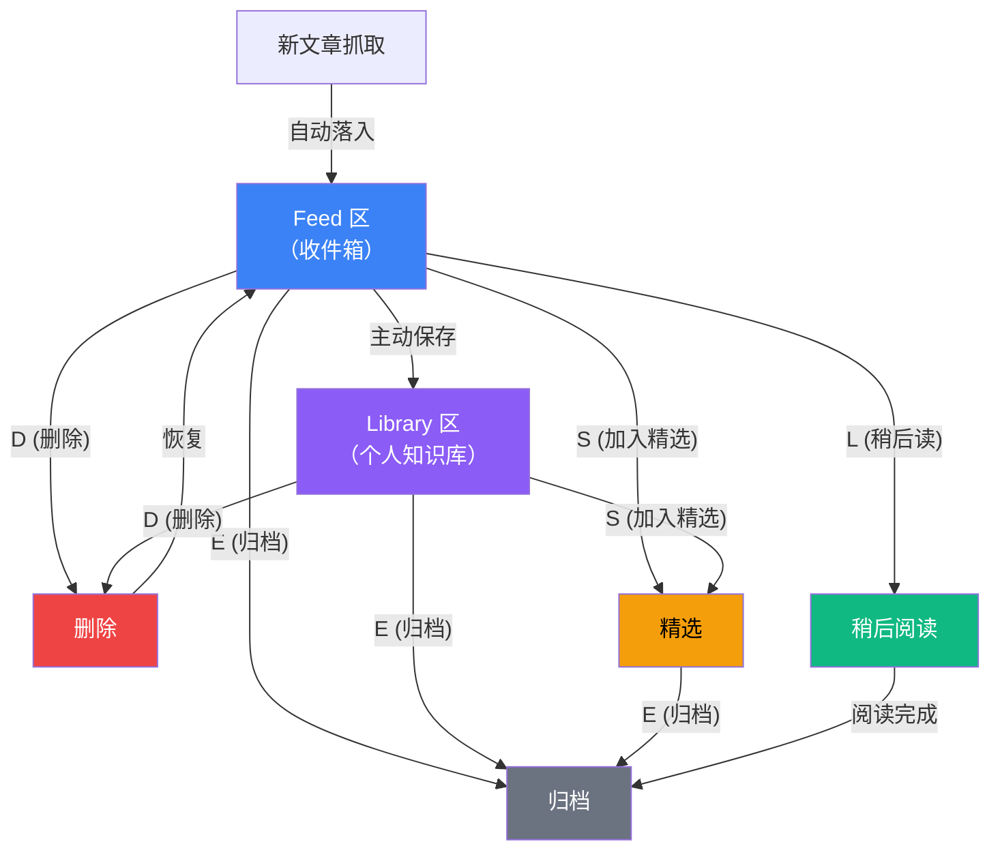

**状态流转规则：**

| 操作 | 快捷键 | 说明 |
|------|-------|------|
| 归档 | `E` | 标记已读完，移出视线 |
| 删除 | `D` | 移入废纸篓 |
| 稍后读 | `L` | 推入稍后阅读队列 |
| 精选 | `S` | 标记高优先级 |
| 撤销 | `Z` | 回退上一步操作 |
| 批量操作 | `Shift+选择` | 批量执行上述操作 |

### 4. AI 智能分析

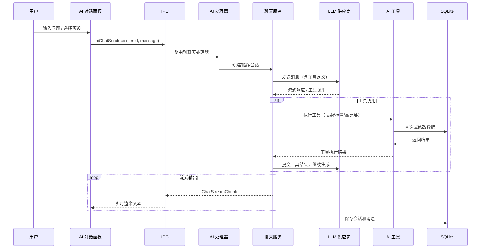

**AI 工具体系：**

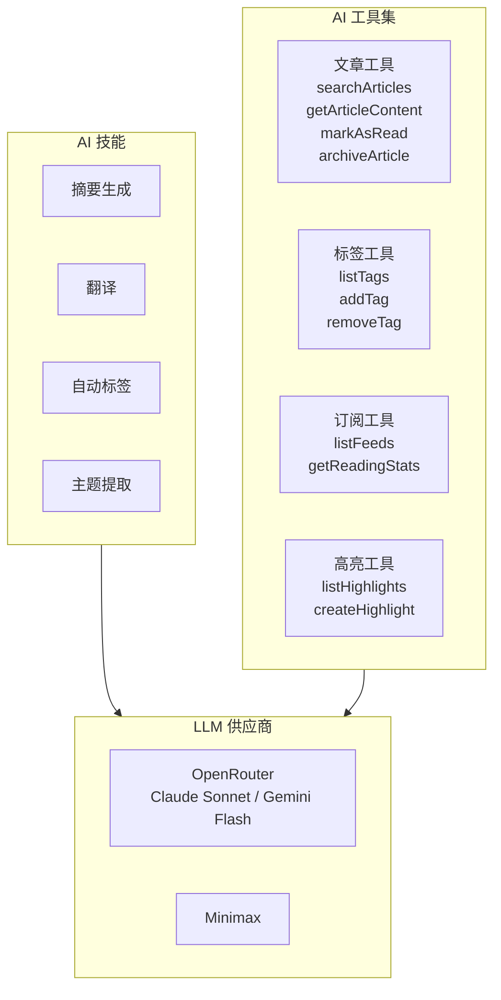

### 5. 播客收听与转录

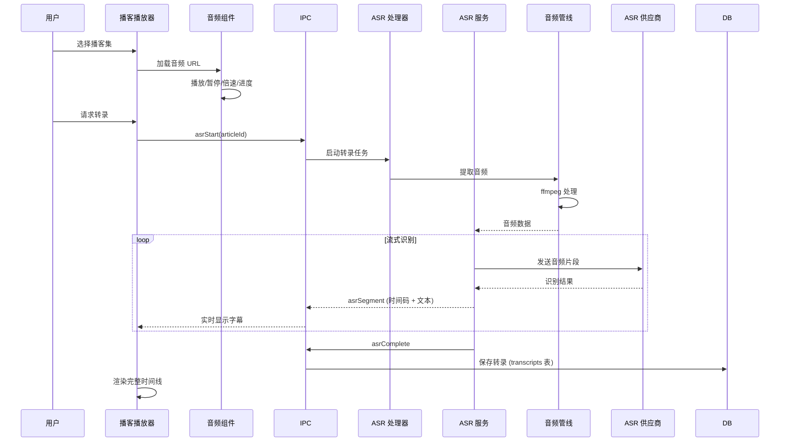

**播客播放器功能：**
- 音频播放控制（播放/暂停/进度/音量）
- 倍速播放（0.5x - 3x）
- 章节导航
- 时间戳字幕同步显示
- 前进/后退 30 秒

### 6. iCloud 同步

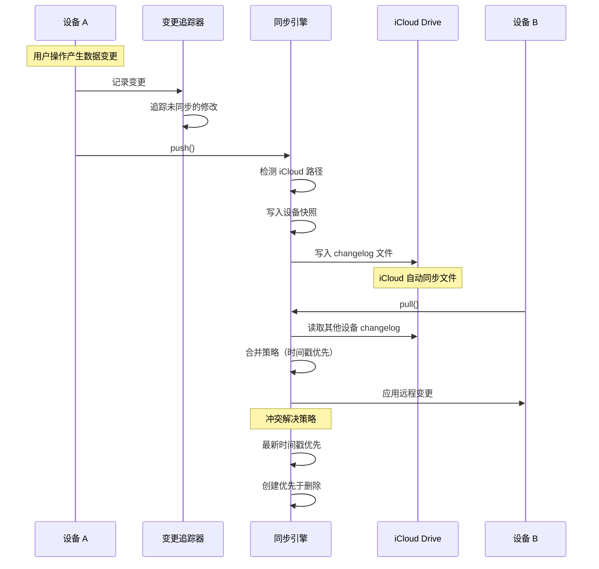

**同步架构组件：**

| 组件 | 职责 |
|------|------|
| `sync-engine.ts` | 编排 push/pull 流程 |
| `change-tracker.ts` | 追踪本地未同步变更 |
| `changelog-writer.ts` | 序列化变更到文件 |
| `changelog-reader.ts` | 读取远程设备变更 |
| `merge-strategy.ts` | 冲突解决策略 |
| `snapshot-manager.ts` | 数据库快照管理 |
| `device-identity.ts` | 设备唯一标识 |
| `icloud-detector.ts` | iCloud 路径检测 |

### 7. 电子书阅读

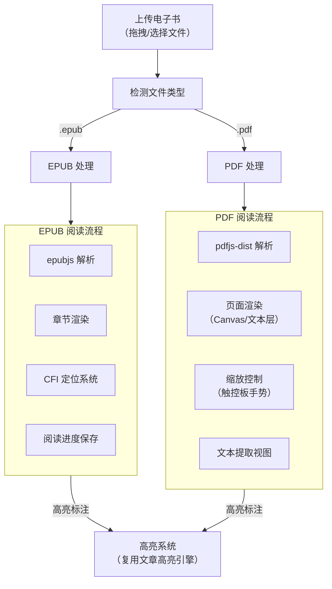

### 8. 分享卡片生成

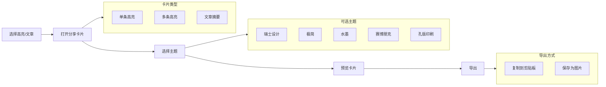

## 数据流全景

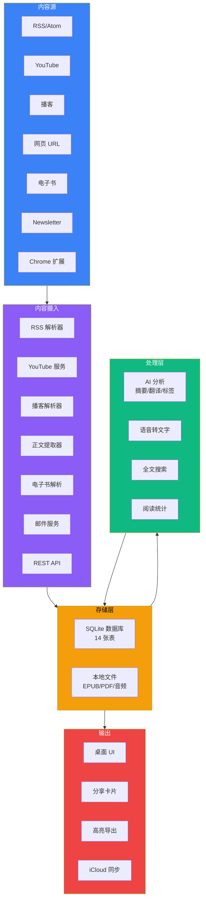

## 状态管理

Z-Reader 采用 **React 内置状态管理** 方案（无 Redux/Zustand），状态分布如下：

| 状态层级 | 管理方式 | 典型数据 |
|---------|---------|---------|
| 全局应用状态 | `App.tsx` 中的 `useState` + 回调传递 | 当前视图模式、选中文章、Modal 状态 |
| 组件局部状态 | 组件内 `useState` | 表单输入、展开/折叠、加载状态 |
| 服务端数据 | IPC 调用 + 手动刷新 | 文章列表、标签、订阅源 |
| 撤销栈 | `useUndoStack` Hook | 操作历史记录 |
| 面板尺寸 | `useResizablePanel` Hook | 拖拽调整的列宽 |

## 错误处理

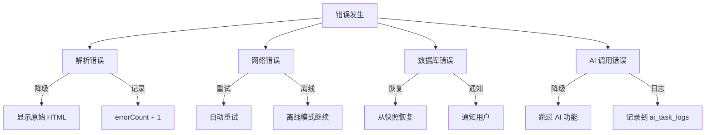

## 国际化

支持中英文双语界面：
- `src/locales/zh.json` - 中文
- `src/locales/en.json` - 英文
- 使用 `i18next` + `react-i18next` 框架
- 语言检测：`i18next-browser-languagedetector`
