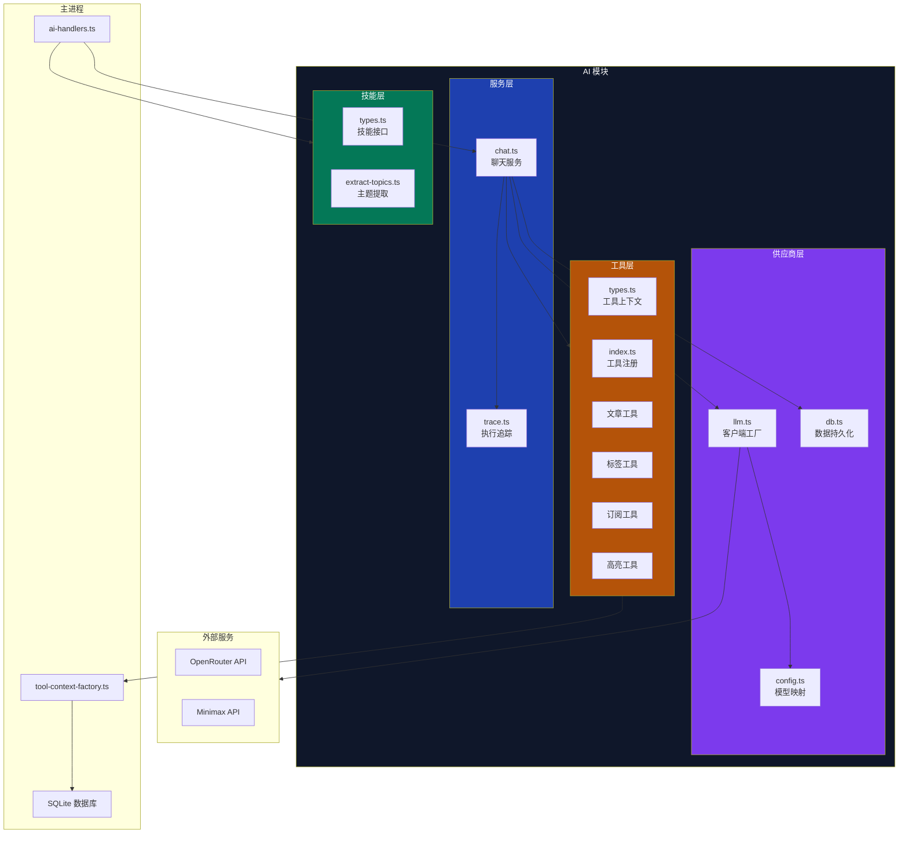
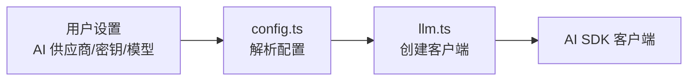
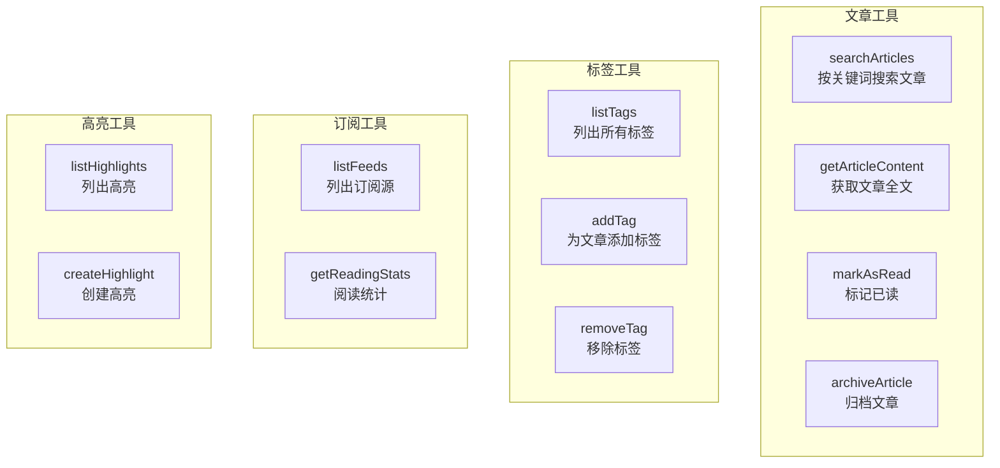
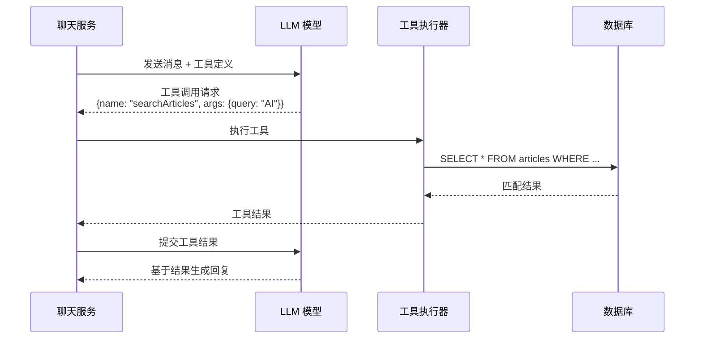
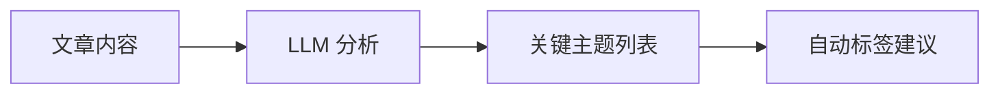
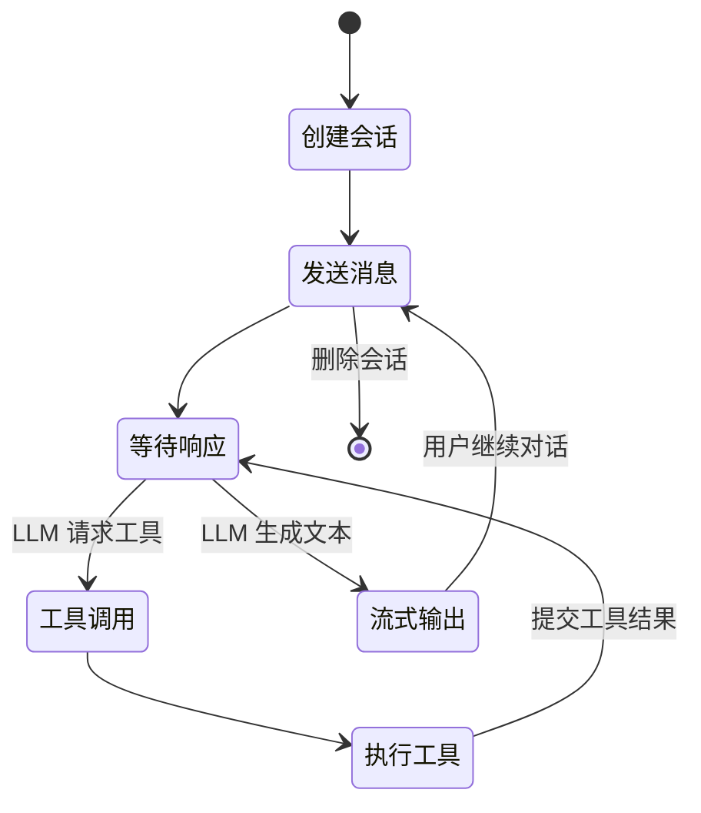
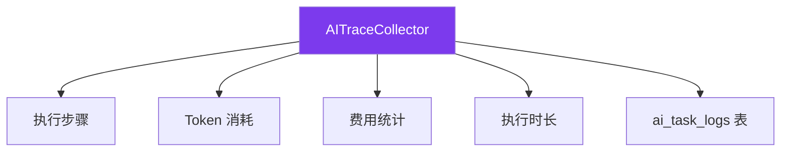

# 深入分析：AI 模块

## 概述

Z-Reader 的 AI 模块提供智能文章分析、对话式问答、自动标签等功能。它基于 Vercel AI SDK 构建，支持多种 LLM 供应商，并通过工具调用 (Tool Calling) 机制让 AI 直接操作应用数据。

## 模块结构

```
src/ai/
├── index.ts           # 模块入口，统一导出
├── providers/         # LLM 供应商层
│   ├── config.ts      # 供应商配置与模型映射
│   ├── llm.ts         # LLM 客户端工厂
│   └── db.ts          # AI 数据持久化
├── services/          # AI 服务层
│   ├── chat.ts        # 聊天服务
│   └── trace.ts       # 执行追踪
├── skills/            # AI 技能定义
│   ├── types.ts       # 技能接口
│   └── extract-topics.ts  # 主题提取技能
└── tools/             # AI 工具定义
    ├── types.ts       # 工具类型与上下文
    ├── index.ts       # 工具注册工厂
    ├── article-tools.ts   # 文章操作工具
    ├── tag-tools.ts       # 标签操作工具
    ├── feed-tools.ts      # 订阅操作工具
    └── highlight-tools.ts # 高亮操作工具
```

## 架构图



## 供应商配置

### 模型映射

Z-Reader 将模型按用途分为三个等级：

| 等级 | 用途 | 默认模型 |
|------|------|---------|
| `fast` | 快速任务（摘要、标签） | Gemini Flash |
| `smart` | 复杂推理（聊天、分析） | Claude Sonnet |
| `cheap` | 低成本任务 | Gemini Flash |

### 支持的供应商

| 供应商 | 说明 | 模型路由 |
|--------|------|---------|
| **OpenRouter** | 统一 API 网关 | 支持 Claude/Gemini/GPT 等 |
| **Minimax** | 国产 LLM | 用于中文场景 |

### 配置流程



## AI 工具系统

AI 工具让 LLM 能够在对话过程中主动查询和操作应用数据。

### 工具上下文 (ToolContext)

```typescript
interface ToolContext {
  // 文章操作
  searchArticles(query: string): Promise<Article[]>
  getArticleContent(id: number): Promise<string>
  markAsRead(id: number): Promise<void>
  archiveArticle(id: number): Promise<void>

  // 标签操作
  listTags(): Promise<Tag[]>
  addTag(articleId: number, tagName: string): Promise<void>
  removeTag(articleId: number, tagName: string): Promise<void>

  // 订阅操作
  listFeeds(): Promise<Feed[]>
  getReadingStats(): Promise<Stats>

  // 高亮操作
  listHighlights(articleId: number): Promise<Highlight[]>
  createHighlight(input: CreateHighlightInput): Promise<Highlight>
}
```

### 工具分类



### 工具调用流程



## AI 技能

### 技能接口

```typescript
interface AISkill {
  name: string           // 技能名称
  description: string    // 描述
  execute(context: AIContext): Promise<AITaskLog>
}

interface AIContext {
  articleId?: number
  content?: string
  settings: AISettingsData
}
```

### 内置技能

| 技能 | 说明 | 输入 | 输出 |
|------|------|------|------|
| **摘要生成** | 生成文章摘要 | 文章内容 | 摘要文本 |
| **翻译** | 翻译文章 | 文章内容 + 目标语言 | 翻译文本 |
| **自动标签** | AI 推荐标签 | 文章内容 | 标签列表 |
| **主题提取** | 提取关键主题 | 文章内容 | 主题列表 |

### 主题提取示例



## 聊天服务

### 会话管理



### 流式输出

AI 聊天采用流式响应模式：

1. 渲染进程通过 `send(AI_CHAT_SEND)` 发起请求
2. ChatService 调用 LLM 并获取流式响应
3. 每个 token chunk 通过 IPC 事件推送到渲染进程
4. ChatPanel 组件实时渲染增量文本
5. 工具调用结果也作为 chunk 推送显示

### ChatStreamChunk 类型

```typescript
type ChatStreamChunk = {
  type: 'text-delta'    // 文本增量
  content: string
} | {
  type: 'tool-call'     // 工具调用
  toolName: string
  args: any
} | {
  type: 'tool-result'   // 工具结果
  toolName: string
  result: any
} | {
  type: 'done'          // 完成
}
```

## 执行追踪

`AITraceCollector` 类记录每次 AI 操作的详细执行信息：



## AI 预设模板

用户可以创建和管理 Prompt 预设模板：

| 字段 | 说明 |
|------|------|
| `name` | 预设名称 |
| `prompt` | Prompt 模板文本 |
| `category` | 分类（摘要/翻译/分析等） |
| `sortOrder` | 排序权重 |
| `isBuiltin` | 是否内置（不可删除） |

支持操作：创建、更新、删除、重排序、重置内置模板。

## 数据持久化

`AIDatabase` 类封装了所有 AI 相关的数据操作：

| 数据 | 表 | 说明 |
|------|---|------|
| 预设模板 | `ai_prompt_presets` | CRUD + 排序 |
| 任务日志 | `ai_task_logs` | 记录每次 AI 操作 |
| 聊天会话 | `chat_sessions` | 会话元数据 |
| 聊天消息 | `chat_messages` | 消息历史（含工具调用） |

## 潜在改进

1. **多模态支持**：图片/PDF 直接输入 LLM 分析
2. **RAG（检索增强生成）**：基于向量数据库实现知识检索
3. **本地模型支持**：集成 Ollama 等本地推理引擎
4. **对话上下文优化**：智能压缩长对话历史
5. **成本控制**：Token 用量预警和限额管理
