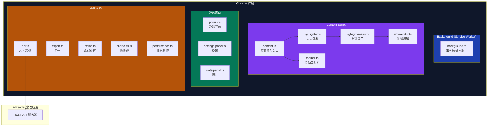
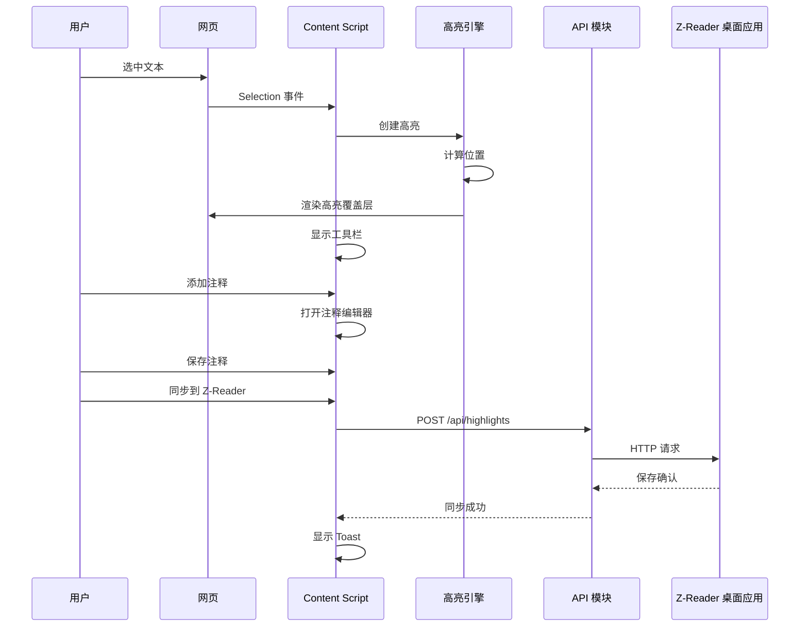
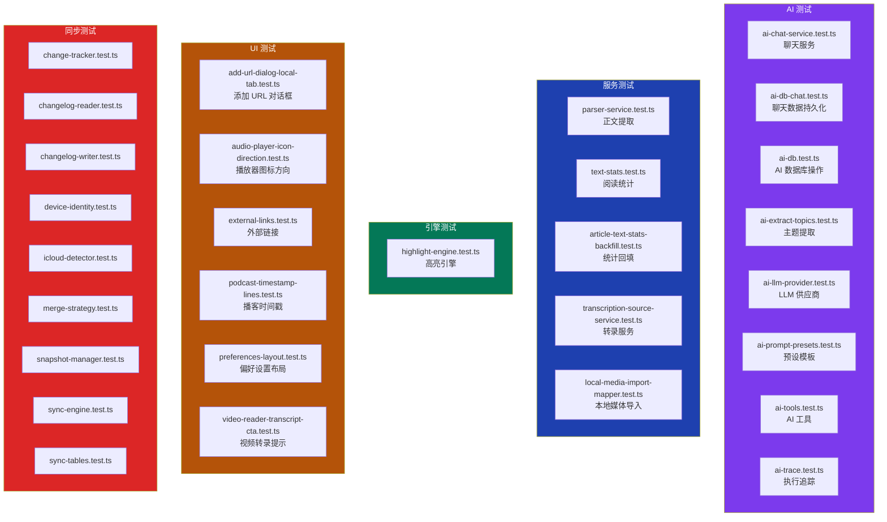

# 深入分析：Chrome 扩展与测试体系

## Chrome 高亮扩展

### 概述

Z-Reader 配套的 Chrome 浏览器扩展，允许用户在任意网页上进行文本高亮和标注，并同步到桌面应用。

### 扩展结构

```
extensions/chrome-highlighter/
├── manifest.json        # 扩展配置 (Manifest V3)
├── build.mjs            # 构建脚本
├── package.json         # 依赖配置
├── tsconfig.json        # TypeScript 配置
├── popup.html           # 弹出窗口 HTML
├── icons/               # 扩展图标
└── src/
    ├── background.ts    # Service Worker
    ├── content.ts       # Content Script
    ├── popup.ts         # 弹出窗口逻辑
    ├── highlighter.ts   # 高亮引擎
    ├── toolbar.ts       # 工具栏 UI
    ├── highlight-menu.ts # 高亮右键菜单
    ├── note-editor.ts   # 注释编辑器
    ├── settings-panel.ts # 设置面板
    ├── api.ts           # 与桌面应用通信
    ├── types.ts         # 类型定义
    ├── export.ts        # 高亮导出
    ├── offline.ts       # 离线处理
    ├── shortcuts.ts     # 快捷键
    ├── stats-panel.ts   # 统计面板
    ├── toast.ts         # Toast 通知
    └── performance.ts   # 性能监控
```

### 架构



### 工作流程



### 核心功能

| 功能 | 实现文件 | 说明 |
|------|---------|------|
| 文本高亮 | `highlighter.ts` | 多颜色选择，DOM 锚点定位 |
| 注释编辑 | `note-editor.ts` | 为高亮添加文字注释 |
| 浮动工具栏 | `toolbar.ts` | 选中文本后显示操作按钮 |
| 右键菜单 | `highlight-menu.ts` | Chrome 上下文菜单集成 |
| 键盘快捷键 | `shortcuts.ts` | 自定义快捷键 |
| 离线模式 | `offline.ts` | 离线时本地缓存，联网后同步 |
| 数据导出 | `export.ts` | 导出高亮数据 |
| 性能监控 | `performance.ts` | 页面注入性能追踪 |
| 统计面板 | `stats-panel.ts` | 高亮/注释统计 |

---

## 测试体系

### 概述

Z-Reader 使用 **Vitest** 作为测试框架，配合 **jsdom** 环境进行 DOM 相关测试。测试覆盖了 AI、数据库、服务、引擎、UI 等多个层面。

### 测试配置

```
vitest.config.ts
├── 环境: jsdom
├── 测试目录: tests/
├── 文件匹配: *.test.ts
└── 运行命令: pnpm test (vitest run)
```

### 测试文件清单



### 测试分布

| 类别 | 测试文件数 | 覆盖范围 |
|------|-----------|---------|
| AI | 8 | 聊天、数据库、工具、追踪、预设 |
| 同步 | 9 | 变更追踪、读写、合并、快照、引擎 |
| 服务 | 5 | 解析、统计、转录、媒体导入 |
| UI | 6 | 对话框、播放器、链接、布局 |
| 引擎 | 1 | 高亮引擎 |
| **总计** | **29** | |

### 测试模式

#### 单元测试

针对独立模块的功能正确性：

```
ai-tools.test.ts
├── 测试工具注册
├── 测试工具执行
├── 测试参数验证
└── 测试返回格式

text-stats.test.ts
├── 中文字数统计
├── 英文词数统计
├── 阅读时间计算
└── 混合语言处理
```

#### 集成测试

测试多个模块协作：

```
sync-engine.test.ts
├── push 流程（变更追踪 → 写入 → 同步）
├── pull 流程（读取 → 合并 → 应用）
├── 冲突解决场景
└── 设备身份管理
```

#### UI 行为测试

使用 jsdom 测试 UI 交互逻辑：

```
add-url-dialog-local-tab.test.ts
├── 本地媒体选项卡渲染
├── 文件选择交互
├── 表单提交验证
└── 错误处理

audio-player-icon-direction.test.ts
├── 前进图标方向
├── 后退图标方向
└── RTL 布局兼容
```

### 同步测试套件

同步模块拥有最完整的测试覆盖（9 个测试文件），验证了：

| 测试文件 | 测试内容 |
|---------|---------|
| `change-tracker.test.ts` | 变更检测、增量追踪 |
| `changelog-reader.test.ts` | 变更日志读取与解析 |
| `changelog-writer.test.ts` | 变更日志序列化与写入 |
| `device-identity.test.ts` | 设备 ID 生成与持久化 |
| `icloud-detector.test.ts` | iCloud 路径检测（macOS） |
| `merge-strategy.test.ts` | 冲突合并策略 |
| `snapshot-manager.test.ts` | 快照创建与恢复 |
| `sync-engine.test.ts` | 完整同步流程 |
| `sync-tables.test.ts` | 同步表初始化 |

### 运行方式

```bash
# 运行所有测试
pnpm test

# 运行特定测试
pnpm test -- tests/ai-tools.test.ts

# 监听模式
npx vitest watch
```

## 潜在改进

### Chrome 扩展
1. **Firefox 支持**：适配 Firefox Add-on 平台
2. **Safari 支持**：利用 Web Extension API 移植
3. **实时同步**：WebSocket 替代轮询
4. **PDF 高亮**：扩展到 PDF 网页内容

### 测试体系
1. **E2E 测试**：引入 Playwright/Cypress 进行端到端测试
2. **覆盖率报告**：配置 Vitest coverage 报告
3. **快照测试**：组件渲染快照测试
4. **性能基准**：添加性能回归测试
5. **Mock 标准化**：统一 Mock 策略和工具
