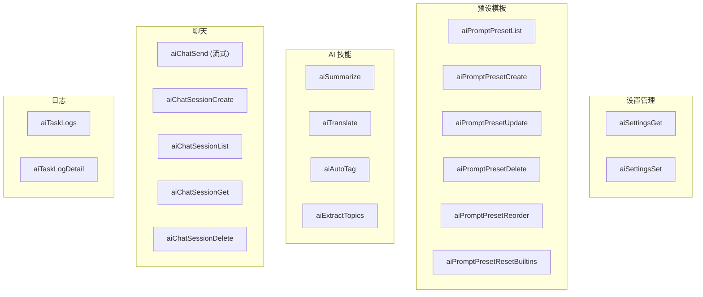

# 深入分析：IPC 通信层

## 概述

IPC（进程间通信）层是 Z-Reader 主进程与渲染进程之间的桥梁。它由 20+ 处理器模块组成，定义了 60+ 通信通道，覆盖了应用的全部数据操作。

## 架构设计

```mermaid
graph TB
    subgraph Renderer["渲染进程"]
        Component["React 组件"]
        ElectronAPI["window.electronAPI"]
    end

    subgraph Preload["Preload 脚本"]
        ContextBridge["contextBridge"]
        IpcRenderer["ipcRenderer"]
    end

    subgraph Main["主进程"]
        IPCIndex["ipc/index.ts<br/>注册入口"]

        subgraph Handlers["处理器模块 (20+)"]
            FH["feed-handlers"]
            AH["article-handlers"]
            HH["highlight-handlers"]
            TH["tag-handlers"]
            BH["book-handlers"]
            TransH["transcript-handlers"]
            AIH["ai-handlers"]
            ASRH["asr-handlers"]
            SyncH["sync-handlers"]
            DiscH["discover-handlers"]
            ShareH["share-card-handlers"]
            PodH["podcast-handlers"]
            NLH["newsletter-handlers"]
            SetH["settings-handlers"]
            DLH["download-handlers"]
            ExtH["external-handlers"]
            ExpH["export-handlers"]
            NotifH["notification-handlers"]
            TaskH["app-task-handlers"]
            HTH["highlight-tag-handlers"]
        end
    end

    Component -->|调用方法| ElectronAPI
    ElectronAPI -->|invoke/send| ContextBridge
    ContextBridge -->|ipcRenderer| IpcRenderer
    IpcRenderer -->|通道路由| IPCIndex
    IPCIndex --> Handlers

    style Renderer fill:#7C3AED,color:#fff
    style Preload fill:#047857,color:#fff
    style Main fill:#1E40AF,color:#fff
```



## 通道常量定义

所有 IPC 通道名在 `src/shared/ipc-channels.ts` 中集中定义，防止字符串拼写错误：

```
IPC_CHANNELS
├── FEED_ADD / FEED_LIST / FEED_UPDATE / FEED_DELETE
├── FEED_FETCH / FEED_FETCH_ALL / FEED_IMPORT_OPML
├── FEED_TOGGLE_PIN / FEED_ARTICLE_COUNT
├── ARTICLE_LIST / ARTICLE_GET / ARTICLE_UPDATE / ARTICLE_DELETE
├── ARTICLE_PARSE_CONTENT / ARTICLE_SEARCH
├── ARTICLE_RESTORE / ARTICLE_PERMANENT_DELETE / ARTICLE_LIST_DELETED
├── ARTICLE_BATCH_UPDATE / ARTICLE_BATCH_DELETE
├── ARTICLE_SAVE_URL / ARTICLE_IMPORT_LOCAL_MEDIA / ARTICLE_READ_LOCAL_MEDIA
├── ARTICLE_SAVE_TO_LIBRARY
├── HIGHLIGHT_LIST / HIGHLIGHT_CREATE / HIGHLIGHT_DELETE / HIGHLIGHT_UPDATE
├── HIGHLIGHT_EXPORT / HIGHLIGHT_LIST_BY_BOOK / HIGHLIGHT_CREATE_FOR_BOOK
├── TAG_LIST / TAG_CREATE / TAG_DELETE
├── ARTICLE_TAG_ADD / ARTICLE_TAG_REMOVE
├── ARTICLE_LIST_BY_TAG / ARTICLE_TAGS_FOR_ARTICLE
├── HIGHLIGHT_TAG_ADD / HIGHLIGHT_TAG_REMOVE
├── HIGHLIGHT_TAGS_FOR_HIGHLIGHT / HIGHLIGHT_TAGS_BATCH
├── BOOK_LIST / BOOK_GET / BOOK_IMPORT / BOOK_DELETE / BOOK_UPDATE
├── BOOK_GET_CONTENT / BOOK_GET_FILE_PATH / BOOK_READ_FILE
├── BOOK_PERMANENT_DELETE / BOOK_RESTORE
├── BOOK_HIGHLIGHT_LIST / BOOK_HIGHLIGHT_CREATE
├── TRANSCRIPT_GET / TRANSCRIPT_FETCH / TRANSCRIPT_UPDATE_SPEAKER
├── YOUTUBE_* / PODCAST_* / DOWNLOAD_* / SETTINGS_*
├── DISCOVER_* / NEWSLETTER_* / SHARE_CARD_*
├── AI_SETTINGS_GET / AI_SETTINGS_SET / AI_PROMPT_PRESET_*
├── AI_SUMMARIZE / AI_TRANSLATE / AI_AUTO_TAG / AI_EXTRACT_TOPICS
├── AI_TASK_LOGS / AI_TASK_LOG_DETAIL
├── AI_CHAT_SEND / AI_CHAT_SESSION_*
├── ASR_START / ASR_CANCEL / ASR_PROGRESS / ASR_SEGMENT / ASR_COMPLETE / ASR_ERROR
├── APP_TASK_* / NOTIFICATION_*
└── SYNC_STATUS / SYNC_ENABLE / SYNC_NOW / SYNC_DEVICES
```

## 通信模式

### 模式 1：请求-响应 (invoke/handle)

用于大多数 CRUD 操作：

```
渲染进程                          主进程
   │                               │
   │── invoke(ARTICLE_GET, id) ───>│
   │                               │── 查询数据库
   │<── 返回 Article 对象 ─────────│
```

### 模式 2：单向事件 (send)

用于发起流式操作：

```
渲染进程                          主进程
   │                               │
   │── send(AI_CHAT_SEND, msg) ──>│
   │                               │── 开始流式处理
```

### 模式 3：事件订阅 (on/off)

用于接收流式数据：

```
渲染进程                          主进程
   │                               │
   │── on(AI_CHAT_STREAM) ───────>│
   │                               │── 生成 chunk 1
   │<── ChatStreamChunk ──────────│
   │                               │── 生成 chunk 2
   │<── ChatStreamChunk ──────────│
   │                               │── 完成
   │<── done: true ───────────────│
   │── off(AI_CHAT_STREAM) ──────>│  // 取消订阅防止内存泄漏
```

## 处理器模块详解

### feed-handlers - 订阅源管理

| 通道 | 入参 | 返回 | 说明 |
|------|------|------|------|
| `feedAdd` | `{url, category?}` | `Feed` | 添加订阅源 |
| `feedList` | - | `Feed[]` | 列出全部订阅源 |
| `feedUpdate` | `{id, ...fields}` | `Feed` | 更新订阅源信息 |
| `feedDelete` | `id` | `void` | 删除订阅源 |
| `feedFetch` | `id` | `Article[]` | 抓取单个订阅源 |
| `feedFetchAll` | - | `void` | 抓取全部订阅源 |
| `feedImportOpml` | `opmlXml` | `{imported, failed}` | OPML 批量导入 |
| `feedTogglePin` | `id` | `Feed` | 切换置顶 |
| `feedArticleCount` | - | `FeedArticleCount[]` | 各订阅源文章计数 |

### article-handlers - 文章管理

| 通道 | 入参 | 返回 | 说明 |
|------|------|------|------|
| `articleList` | `ArticleListQuery` | `Article[]` | 文章列表（支持过滤/排序） |
| `articleGet` | `id` | `Article` | 获取单篇文章 |
| `articleUpdate` | `{id, ...fields}` | `Article` | 更新文章状态 |
| `articleDelete` | `id` | `void` | 软删除文章 |
| `articleSearch` | `{query}` | `Article[]` | 全文搜索 |
| `articleBatchUpdate` | `{ids, fields}` | `void` | 批量更新 |
| `articleBatchDelete` | `ids` | `void` | 批量删除 |
| `articleSaveUrl` | `{url}` | `Article` | 保存网页 URL |
| `articleImportLocalMedia` | `{filePath}` | `Article` | 导入本地媒体 |
| `articleSaveToLibrary` | `id` | `Article` | 从 Feed 保存到 Library |

### ai-handlers - AI 操作

这是最复杂的处理器模块（约 25KB），处理所有 AI 相关操作：



## Preload 桥接设计

`src/preload.ts` 实现了安全的 IPC 桥接：

```typescript
// 伪代码示意
const electronAPI = {
  // 请求-响应模式
  feedAdd: (input) => ipcRenderer.invoke(FEED_ADD, input),
  articleGet: (id) => ipcRenderer.invoke(ARTICLE_GET, id),
  
  // 事件发送模式
  aiChatSend: (sessionId, message) => 
    ipcRenderer.send(AI_CHAT_SEND, { sessionId, message }),
  
  // 事件订阅模式（返回取消订阅函数）
  onAiChatStream: (callback) => {
    ipcRenderer.on(AI_CHAT_STREAM, (event, chunk) => callback(chunk))
    return () => ipcRenderer.removeAllListeners(AI_CHAT_STREAM)
  }
}

contextBridge.exposeInMainWorld('electronAPI', electronAPI)
```

**安全设计要点：**
- 渲染进程无法直接访问 `ipcRenderer`
- 所有方法通过 `contextBridge` 白名单暴露
- 通道名使用常量避免注入风险
- 事件订阅返回取消函数防止内存泄漏

## 类型系统

`src/shared/types.ts` 中的 `ElectronAPI` 接口定义了所有可用方法的签名（约 170 行），确保渲染进程调用时获得完整类型提示。

## 潜在改进

1. **通道版本控制**：为 Schema 变更时的兼容性预留版本号
2. **请求中间件**：添加日志、性能监控、权限检查等通用逻辑
3. **错误标准化**：统一 IPC 错误响应格式
4. **批量调用优化**：支持一次 IPC 调用执行多个操作
