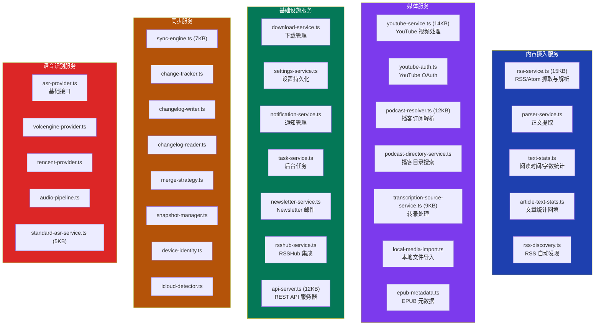
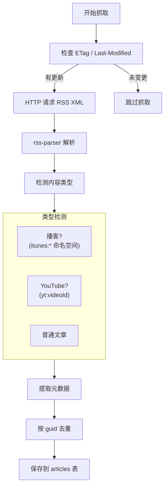
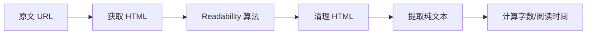
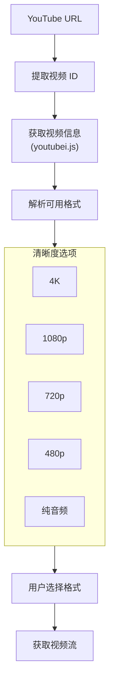
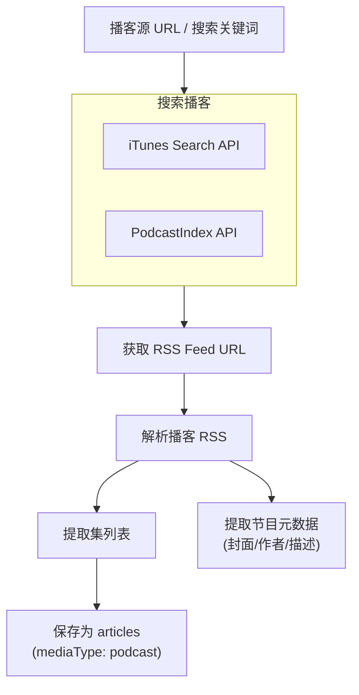
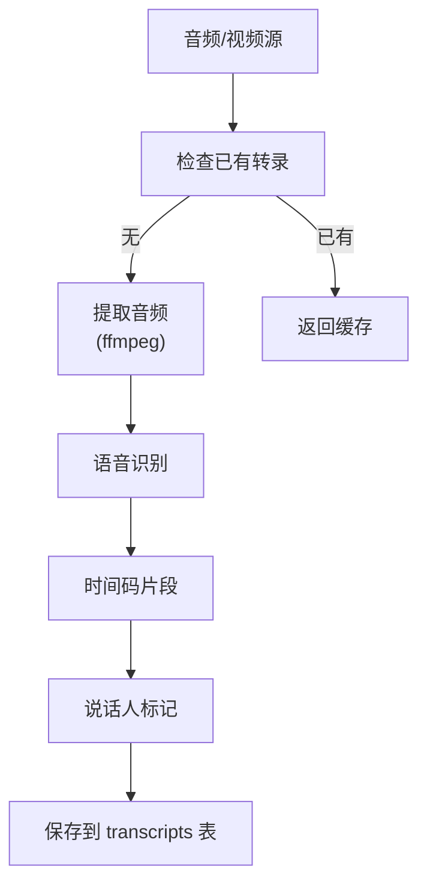
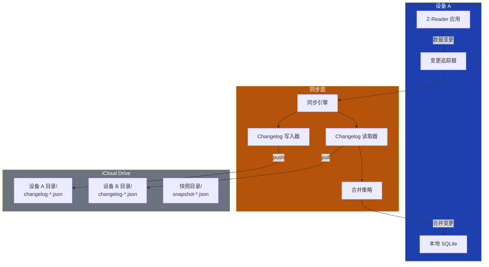
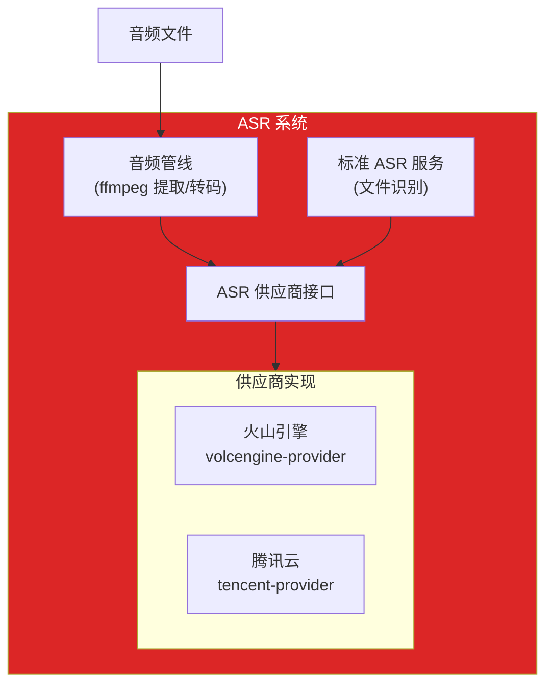
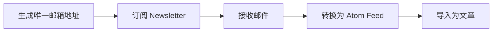
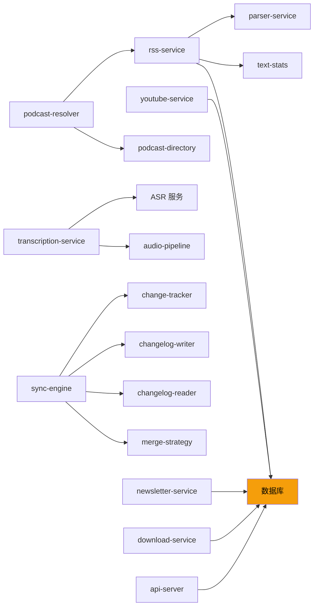

# 深入分析：业务服务层

## 概述

业务服务层位于主进程中，是 Z-Reader 的核心逻辑所在。它处理 RSS 抓取、内容解析、播客/视频管理、下载、同步等所有后端业务。

## 服务全景

## 内容摄入服务

### rss-service.ts - RSS 抓取引擎

Z-Reader 的核心服务，负责所有 RSS/Atom 内容的获取和解析。

**核心功能：**

| 方法 | 说明 |
|------|------|
| `parseFeed(url, etag, lastModified)` | 解析单个 RSS/Atom 源 |
| `fetchFeed(feedId)` | 抓取并更新单个订阅源 |
| `fetchAllFeeds()` | 抓取所有订阅源 |
| `startScheduledFetch(interval)` | 启动定时抓取（默认 15 分钟） |
| `backfillMissingContent()` | 回填缺失的文章正文 |

**自定义字段处理：**

| 字段 | 说明 | 来源 |
|------|------|------|
| `content:encoded` | 完整 HTML 正文 | RSS 2.0 |
| `yt:videoId` | YouTube 视频 ID | YouTube RSS |
| `itunes:duration` | 播客时长 | iTunes RSS |
| `itunes:image` | 播客封面 | iTunes RSS |
| `itunes:season` | 季号 | iTunes RSS |
| `itunes:episode` | 集号 | iTunes RSS |

### parser-service.ts - 正文提取

使用 `@postlight/parser` 从原始 HTML 中提取结构化文章内容：

### text-stats.ts - 阅读统计

根据文本内容计算阅读指标：
- 字数统计（中文按字符，英文按空格分词）
- 阅读时间估算（中文 300 字/分钟，英文 250 词/分钟）

## 媒体服务

### youtube-service.ts - YouTube 集成

**功能：**
- 视频信息获取（标题、时长、缩略图）
- 多清晰度流提取
- 字幕/转录获取
- OAuth 认证（年龄限制内容）

### podcast-resolver.ts - 播客解析

### transcription-source-service.ts - 转录服务

管理音视频转录的完整流程：

## 同步服务

### iCloud 同步架构

**同步组件职责：**

| 组件 | 职责 |
|------|------|
| `sync-engine.ts` | 编排 push/pull 全流程 |
| `change-tracker.ts` | 追踪每次 CRUD 操作的变更 |
| `changelog-writer.ts` | 将变更序列化为 JSON 文件 |
| `changelog-reader.ts` | 读取其他设备的变更文件 |
| `merge-strategy.ts` | 基于时间戳的冲突解决 |
| `snapshot-manager.ts` | 定期创建数据快照 |
| `device-identity.ts` | 生成唯一设备 ID |
| `icloud-detector.ts` | 检测 iCloud Drive 路径 |

**冲突解决策略：**
1. 以 `updatedAt` 时间戳最新的记录为准
2. 创建操作优先于删除操作
3. 字段级合并（非整条记录覆盖）

## ASR 语音识别服务

**支持模式：**
- **实时识别**：流式推送音频片段，逐句返回结果
- **标准识别**：上传完整音频文件，批量返回结果

## 基础设施服务

### api-server.ts - REST API

提供 HTTP API 供外部应用（如 Chrome 扩展）访问：

| 端点 | 方法 | 说明 |
|------|------|------|
| `/api/articles` | GET | 获取文章列表 |
| `/api/articles/:id` | GET | 获取单篇文章 |
| `/api/articles` | POST | 保存文章 |
| `/api/feeds` | GET | 获取订阅列表 |
| `/api/highlights` | POST | 创建高亮 |

### newsletter-service.ts - Newsletter 集成

### rsshub-service.ts - RSSHub 集成

与 RSSHub 服务交互，提供丰富的 RSS 源发现：
- 查询 RSSHub 可用路由
- 按分类浏览源
- 生成自定义 RSS URL
- 预览 Feed 内容

## 服务间依赖关系

## 潜在改进

1. **服务抽象层**：引入依赖注入容器，解耦服务间依赖
2. **重试机制**：RSS 抓取失败时的指数退避重试
3. **缓存层**：热点数据内存缓存，减少数据库查询
4. **任务队列**：后台任务统一队列管理
5. **健康检查**：服务状态监控与自动恢复
6. **日志系统**：结构化日志，便于问题排查
