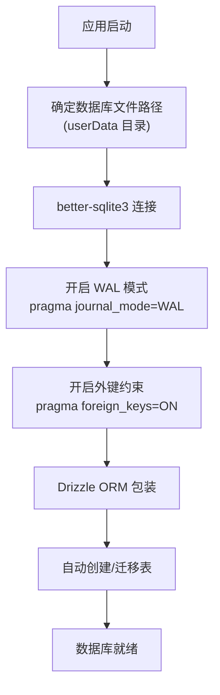
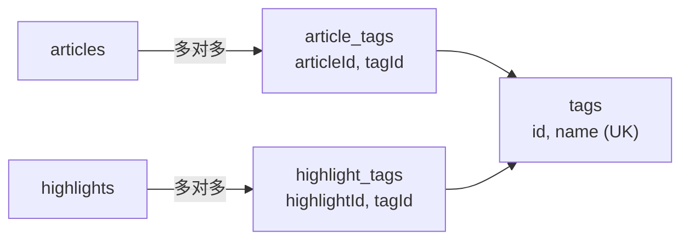

# 深入分析：数据库与数据层

## 概述

Z-Reader 的数据层采用 **SQLite + Drizzle ORM** 的组合，是整个应用的数据基石。所有内容存储、查询、同步均通过此层完成。

## 核心职责

- 定义和维护 14 张数据表的 Schema
- 提供类型安全的数据库操作接口
- 管理数据库连接与初始化
- 支持 WAL 模式并发读写
- 为 iCloud 同步提供数据基础

## 关键文件

| 文件 | 路径 | 说明 |
|------|------|------|
| `schema.ts` | `src/main/db/schema.ts` | 全部表定义（Drizzle Schema） |
| `index.ts` | `src/main/db/index.ts` | 数据库初始化与连接 |
| `drizzle.config.ts` | 项目根目录 | Drizzle Kit 配置 |

## 数据库初始化流程



## Schema 设计详解

### 内容核心表

#### feeds 表 - 订阅源

```
feeds
├── id           INTEGER PK AUTOINCREMENT
├── url          TEXT UNIQUE NOT NULL     -- RSS/Atom 源 URL
├── title        TEXT                     -- 订阅源标题
├── description  TEXT                     -- 描述
├── favicon      TEXT                     -- 图标 URL
├── category     TEXT                     -- 分类
├── fetchInterval INTEGER DEFAULT 15      -- 抓取间隔（分钟）
├── lastFetchedAt TEXT                    -- 最后抓取时间
├── errorCount   INTEGER DEFAULT 0        -- 连续错误次数
├── pinned       INTEGER DEFAULT 0        -- 是否置顶
├── feedType     TEXT DEFAULT 'rss'       -- 类型: rss/podcast/youtube/newsletter
├── createdAt    TEXT DEFAULT now()
├── updatedAt    TEXT DEFAULT now()
└── deletedFlg   INTEGER DEFAULT 0        -- 软删除标记
```

#### articles 表 - 内容条目

```
articles
├── id             INTEGER PK AUTOINCREMENT
├── feedId         INTEGER FK -> feeds.id   -- 所属订阅源
├── guid           TEXT UNIQUE               -- 全局唯一标识（RSS guid）
├── url            TEXT                      -- 原文 URL
├── title          TEXT                      -- 标题
├── author         TEXT                      -- 作者
├── summary        TEXT                      -- 摘要
├── content        TEXT                      -- HTML 正文
├── contentText    TEXT                      -- 纯文本（用于搜索和统计）
├── thumbnail      TEXT                      -- 缩略图 URL
├── wordCount      INTEGER                   -- 字数
├── readingTime    INTEGER                   -- 预计阅读时间（分钟）
├── language       TEXT                      -- 语言
├── publishedAt    TEXT                      -- 发布时间
├── readStatus     TEXT DEFAULT 'unseen'     -- inbox/later/archive/unseen/seen
├── readProgress   REAL DEFAULT 0            -- 阅读进度 (0-1)
├── isShortlisted  INTEGER DEFAULT 0         -- 是否精选
├── source         TEXT DEFAULT 'feed'       -- feed/library
├── domain         TEXT                      -- 来源域名
├── mediaType      TEXT DEFAULT 'article'    -- article/video/podcast
├── videoId        TEXT                      -- YouTube 视频 ID
├── duration       INTEGER                   -- 视频时长（秒）
├── audioUrl       TEXT                      -- 音频 URL
├── audioBytes     INTEGER                   -- 音频大小
├── audioDuration  INTEGER                   -- 音频时长（秒）
├── episodeNumber  INTEGER                   -- 播客集数
├── seasonNumber   INTEGER                   -- 播客季数
├── createdAt      TEXT DEFAULT now()
├── updatedAt      TEXT DEFAULT now()
└── deletedFlg     INTEGER DEFAULT 0
```

**设计要点：**
- `readStatus` 枚举实现 Feed-Library 分流
- `source` 字段区分 Feed 区和 Library 区
- `mediaType` 支持多种内容类型复用同一张表
- 播客/视频特有字段设为可空，避免表拆分

#### highlights 表 - 高亮标注

```
highlights
├── id              INTEGER PK AUTOINCREMENT
├── articleId       INTEGER FK -> articles.id  -- 关联文章
├── bookId          INTEGER FK -> books.id     -- 关联电子书（二选一）
├── text            TEXT NOT NULL               -- 高亮文本
├── note            TEXT                        -- 注释
├── color           TEXT DEFAULT 'yellow'       -- 颜色
├── startOffset     INTEGER                    -- 起始偏移
├── endOffset       INTEGER                    -- 结束偏移
├── anchorPath      TEXT                       -- DOM 锚点路径
├── paragraphIndex  INTEGER                    -- 段落索引
├── createdAt       TEXT DEFAULT now()
├── updatedAt       TEXT DEFAULT now()
└── deletedFlg      INTEGER DEFAULT 0
```

### 关联表

#### tags + article_tags + highlight_tags



### 电子书表

```
books
├── id              INTEGER PK
├── title           TEXT
├── author          TEXT
├── cover           TEXT          -- Base64 封面
├── filePath        TEXT          -- 本地文件路径
├── fileType        TEXT          -- epub / pdf
├── readStatus      TEXT          -- inbox/later/archive
├── readProgress    REAL          -- 0-1
├── currentLocation TEXT          -- EPUB CFI 定位
├── createdAt       TEXT
├── updatedAt       TEXT
└── deletedFlg      INTEGER
```

### AI 相关表

```
ai_prompt_presets                    chat_sessions
├── id                               ├── id
├── name                             ├── title
├── prompt                           ├── articleId
├── category                         ├── type
├── sortOrder                        ├── createdAt
├── isBuiltin                        └── updatedAt
├── createdAt
└── updatedAt                        chat_messages
                                     ├── id
ai_task_logs                         ├── sessionId FK
├── id                               ├── role
├── taskType                         ├── content
├── status                           ├── toolCalls
├── input                            ├── toolResults
├── output                           └── createdAt
├── tokens
├── durationMs
└── createdAt
```

### 其他表

```
transcripts                          downloads
├── id                               ├── id
├── articleId FK                      ├── articleId FK
├── segments (JSON)                  ├── url
├── speakerMap (JSON)                ├── filePath
├── language                         ├── status
├── createdAt                        ├── progress
└── updatedAt                        └── createdAt

views
├── id
├── name
├── query (JSON)
├── sortOrder
├── createdAt
└── updatedAt
```

## 设计模式与约定

### 软删除

所有核心表均包含 `deletedFlg` 字段：
- `0` = 正常
- `1` = 已删除（软删除）

查询时默认过滤 `deletedFlg = 0`，支持恢复已删除数据。

### 时间戳约定

- `createdAt`: 创建时间，`DEFAULT CURRENT_TIMESTAMP`
- `updatedAt`: 更新时间，每次修改自动更新
- 为 CRDT 同步预留，时间戳用于冲突解决

### 类型安全

Drizzle ORM 提供编译时类型检查：
- Schema 定义自动生成 TypeScript 类型
- 查询结果自动推导类型
- INSERT/UPDATE 操作类型受限

## 性能优化

| 策略 | 说明 |
|------|------|
| WAL 模式 | 允许并发读写，提升多操作场景性能 |
| 索引 | `guid` UNIQUE 索引加速去重检查 |
| 增量查询 | 文章列表分页查询，避免一次加载过多 |
| 全文搜索 | 利用 `contentText` 字段进行文本搜索 |
| 批量操作 | `articleBatchUpdate/Delete` 减少 IPC 往返 |

## 潜在改进

1. **FTS5 全文索引**：目前搜索基于 LIKE 查询，可升级为 SQLite FTS5 虚拟表
2. **迁移管理**：可引入 Drizzle Kit 的 migrate 机制管理 Schema 演化
3. **连接池**：当前单连接模式，高并发场景可考虑连接复用
4. **数据压缩**：`content` 字段存储完整 HTML，可考虑压缩存储
