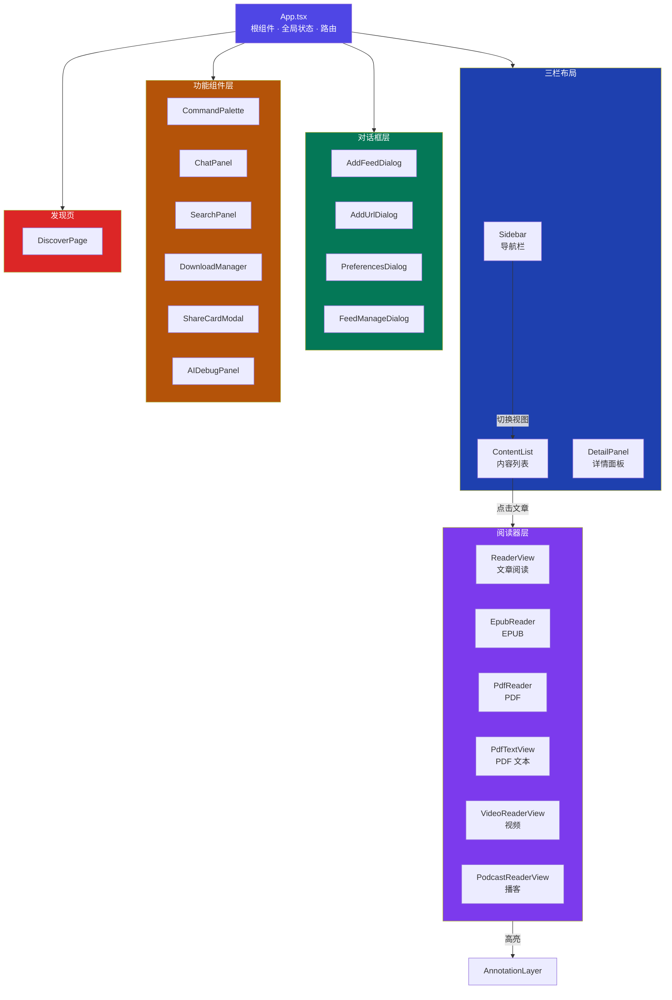
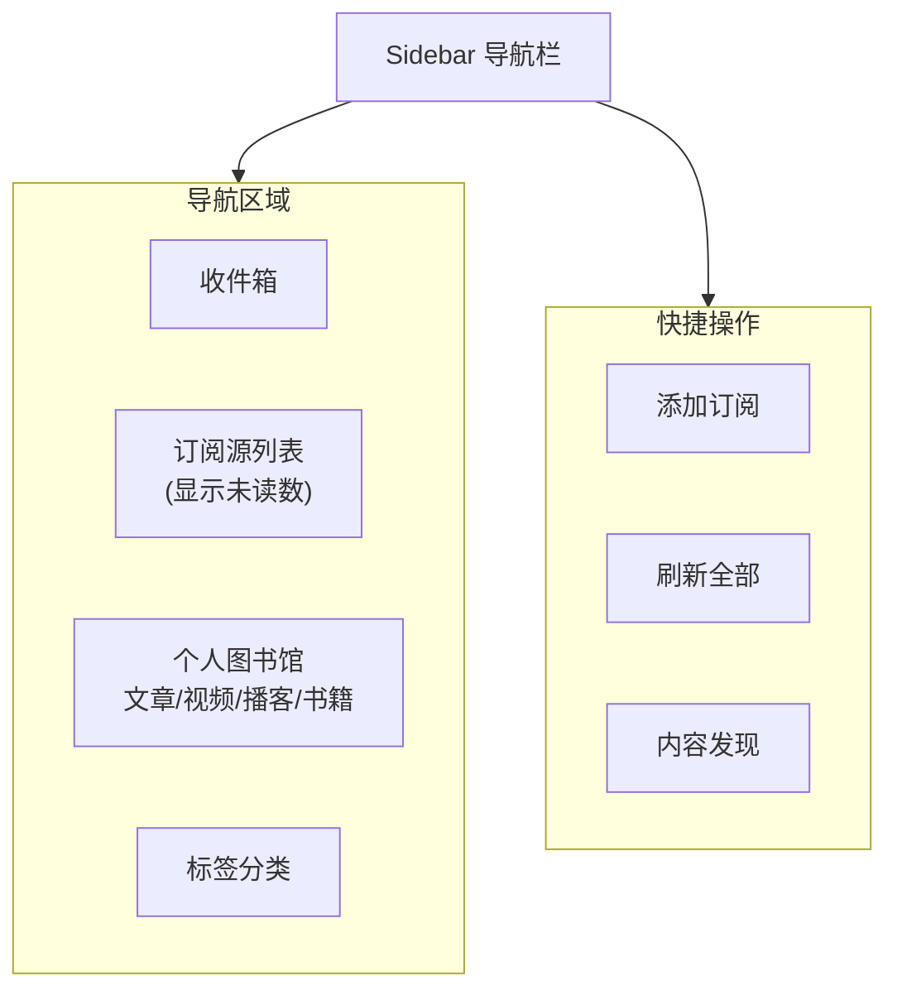
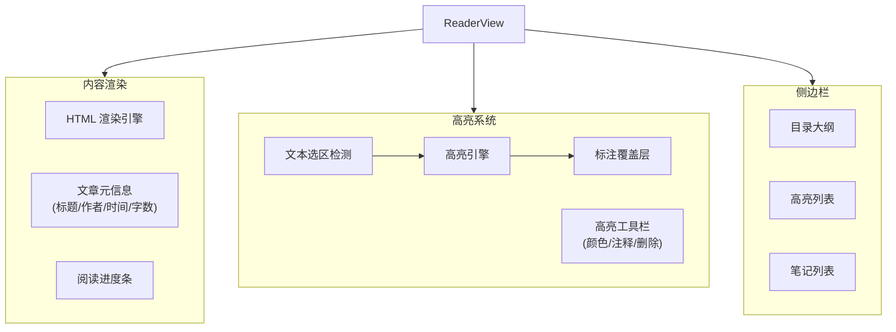
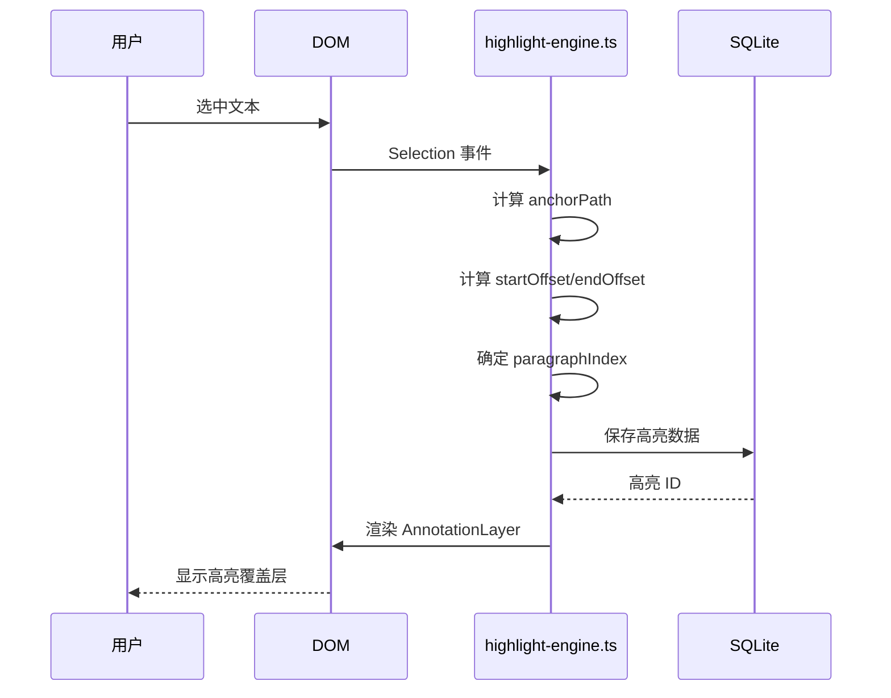
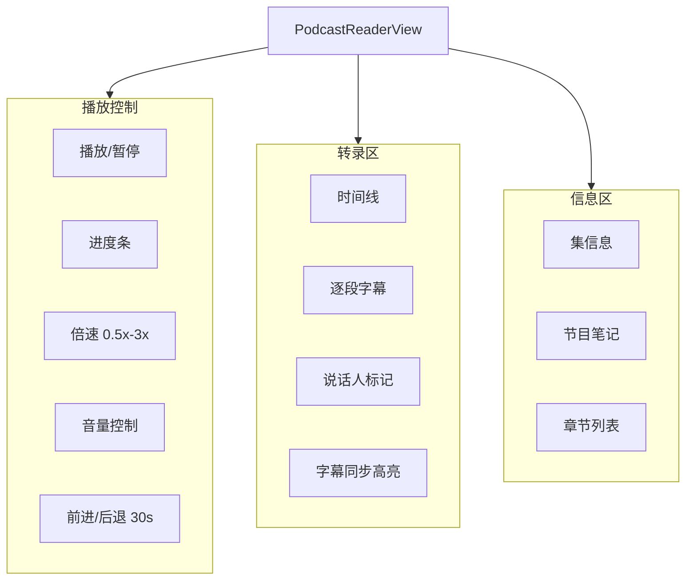
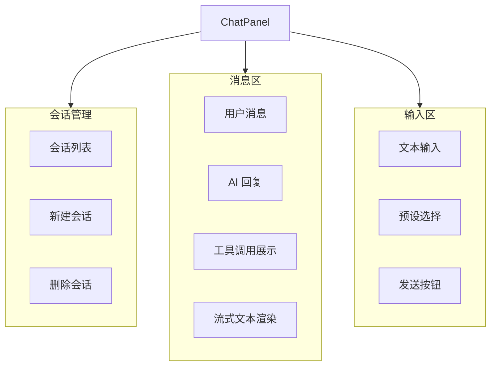
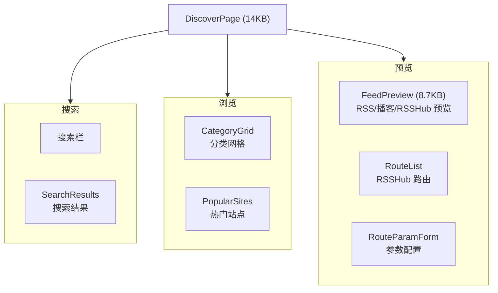
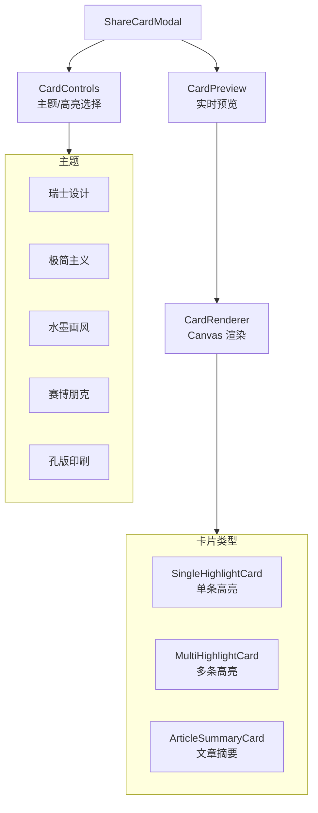
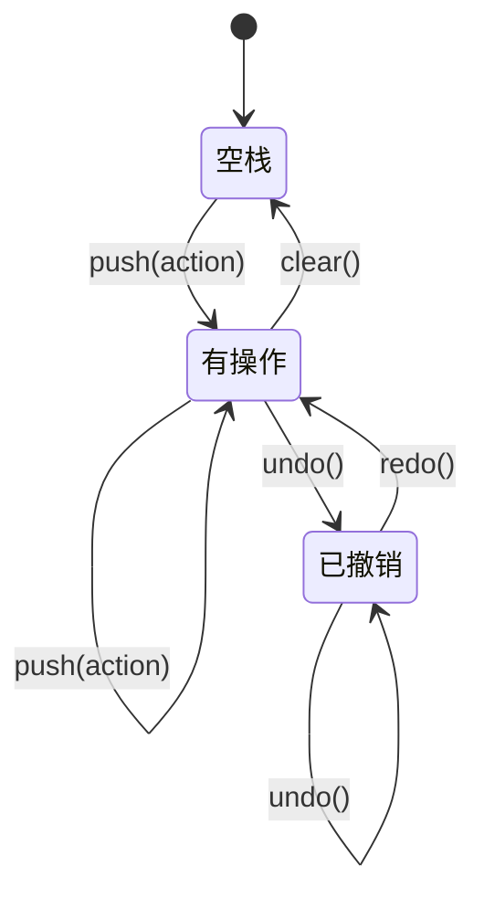

# 深入分析：渲染进程与 UI 组件

## 概述

Z-Reader 的渲染进程采用 React 19 构建，包含 47+ 组件，实现了三栏布局的桌面阅读器界面。UI 风格遵循 Shadcn/UI 的极简设计语言，使用 Tailwind CSS 4 进行样式管理。

## 组件层次结构



## 核心组件详解

### App.tsx - 根组件（约 17KB）

应用的核心状态管理中心：

**管理的全局状态：**
- `currentView`: 当前视图模式（library/feeds/books/videos/podcasts/discover）
- `selectedArticle`: 当前选中的文章
- `selectedBook`: 当前选中的电子书
- `isReaderOpen`: 是否打开阅读器视图
- Modal 开关状态（添加订阅、偏好设置、快捷键帮助等）
- Toast 通知队列

**全局键盘快捷键：**

| 快捷键 | 功能 |
|--------|------|
| `Cmd+K` | 打开命令面板 |
| `Cmd+J` | 切换 AI 面板 |
| `Cmd+N` | 新建内容 |
| `Cmd+,` | 打开偏好设置 |
| `Escape` | 关闭当前面板 |

### Sidebar - 导航栏



### ContentList - 内容列表（约 30KB）

内容列表是应用中最复杂的组件之一：

**功能：**
- 文章/视频/播客的列表展示
- 多种排序方式（时间/标题/阅读状态）
- 状态过滤（收件箱/已看/归档等）
- 批量选择（Shift+点击）
- 批量操作（归档/删除/标签）
- 分页加载
- 拖拽排序

**键盘导航：**

| 按键 | 功能 |
|------|------|
| `J` / `↓` | 下一项 |
| `K` / `↑` | 上一项 |
| `Enter` | 打开文章 |
| `E` | 归档 |
| `D` | 删除 |
| `L` | 稍后读 |
| `S` | 精选 |
| `Z` | 撤销 |

### ReaderView - 文章阅读器（约 40KB）



**高亮引擎工作原理：**



### PodcastReaderView - 播客播放器（约 47KB）

应用中最大的单个组件：



### PreferencesDialog - 偏好设置（约 50KB）

最复杂的对话框组件：

| 设置区域 | 内容 |
|---------|------|
| **常规设置** | 语言、主题、启动行为 |
| **AI 设置** | LLM 供应商、API 密钥、模型选择 |
| **ASR 设置** | 语音识别供应商配置 |
| **同步设置** | iCloud 同步开关与状态 |
| **下载设置** | 下载目录、并发数 |
| **快捷键** | 快捷键查看与自定义 |

### ChatPanel - AI 对话面板（约 27KB）



### 发现页组件



### 分享卡片组件



## 自定义 Hooks

| Hook | 用途 |
|------|------|
| `useUndoStack` | 管理撤销/重做操作栈 |
| `useResizablePanel` | 实现面板拖拽调整大小 |

### useUndoStack 工作原理



每次用户执行归档/删除/状态变更等操作时，操作的逆操作被推入撤销栈。按 `Z` 键触发栈顶操作的回滚。

## 工具函数

| 文件 | 功能 |
|------|------|
| `external-links.ts` | 安全打开外部链接（防止 XSS） |
| `podcast-timestamps.ts` | 解析播客时间戳格式（HH:MM:SS） |

## 国际化

渲染进程使用 `react-i18next` 提供多语言支持：

```
src/locales/
├── zh.json   # 中文翻译
└── en.json   # 英文翻译
```

所有 UI 文本通过 `useTranslation()` Hook 获取，支持运行时语言切换。

## 样式系统

- **Tailwind CSS 4**：原子化样式，快速迭代
- **PostCSS**：样式后处理
- **Shadcn/UI 风格**：极简、高信噪比的组件设计
- **全局样式**：`index.css` 定义基础变量和重置样式

## 潜在改进

1. **状态管理升级**：考虑引入 Zustand/Jotai 替代 props drilling
2. **虚拟滚动**：大量文章列表时使用虚拟列表优化性能
3. **组件拆分**：ReaderView(40KB)、PodcastReaderView(47KB) 等大组件需要拆分
4. **Suspense + 懒加载**：按路由/功能懒加载组件
5. **测试覆盖**：增加组件级单元测试
6. **无障碍**：完善 ARIA 属性和键盘焦点管理
